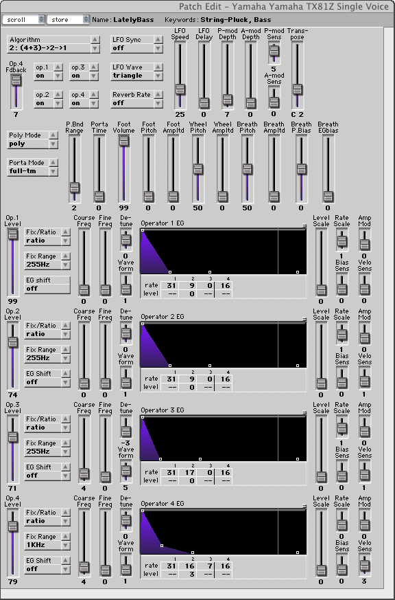
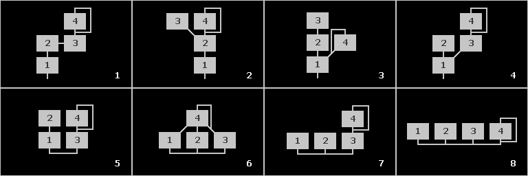
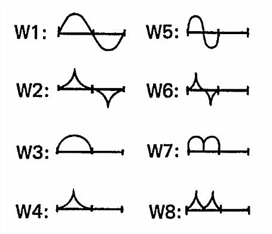

# Supercollider implementation of Yamaha's TX81Z FM synthesizer

This is a port of Csound's simulation of Yamaha's TX81Z

For the original project, see https://github.com/gleb812

## Algorithms in the original implementation (1-8)

## Waveforms (1-8)

