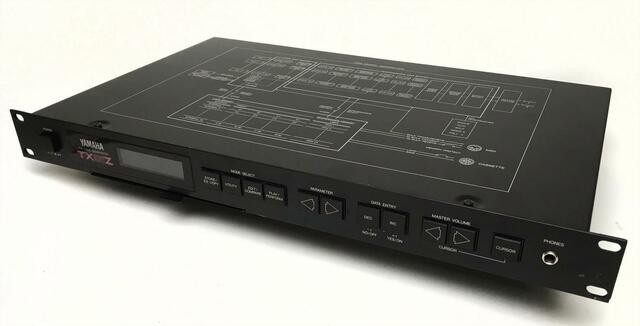

# Supercollider implementation of Yamaha's TX81Z FM synthesizer

This is a port of Csound's simulation of Yamaha's TX81Z

For the original project, see [https://github.com/gleb812]()

## Description

A Port of Csound's version of Yamaha's TX81Z FM synth.

This synth consists of 4 operators which can be wired into multiple configurations (called algorithms). 
Each operator has its own wave type and its associated envelope. All elements of the original 
implementation are simulated (midi velocity curves, envelopes, waveforms, etc)

This is the list of the implemented algorithms:

| Algorithm | Topology              |
|:----------|:----------------------|
| 0         | 4 → 3 → 2 → 1         |
| 1         | (3 + 4) → 2 → 1       |
| 2         | (4 + (3→2)) → 1       |
| 3         | (2 + (4→3)) → 1       |
| 4         | (4→3) + (2→1)         |
| 5         | (4→1) + (4→2) + (4→3) |
| 6         | (4→3) + 2             |
| 7         | 1 + 2 + 3 + 4         |
| 8         | 2 → 1                 |
| 9         | 1                     |
| 10        | 4 → 2 → 1             |
| 11        | (4→4) → 2 → 1         |
| 12        | (4+3) → 2 → 1         |

## Algorithms in the original implementation (1-8)

## Waveforms (1-8)

